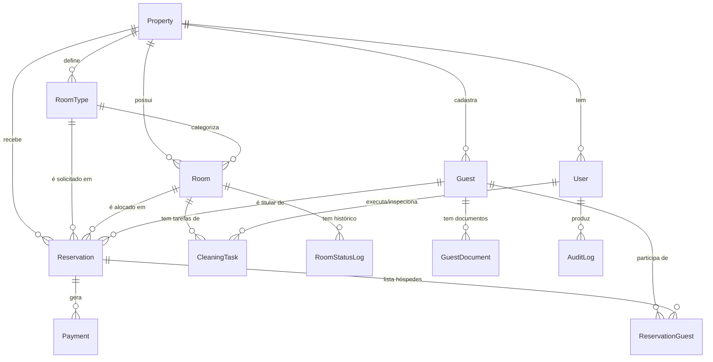

# Modelo de Dados — Hotel Platform MVP

Este documento explica o `schema.prisma` que define o banco de dados da plataforma. Leia antes de mexer no schema, e atualize sempre que mudar algo estrutural.

---

## Visão Geral

O MVP atende um hotel/pousada de 15 a 50 quartos com 7 funcionalidades:

1. Link público de reserva
2. Pagamento (Pix + Cartão via Asaas)
3. Cadastro de hóspedes (com campos FNRH)
4. Agenda de hospedagens
5. Check-in / Check-out
6. Controle de ocupação
7. Controle de limpeza (housekeeping)

O schema foi desenhado para suportar **multi-propriedade desde o dia 1**, mesmo que o primeiro cliente piloto seja uma única pousada. Custo de prever isso agora é baixíssimo; custo de retroadaptar depois é altíssimo.

---

## Diagrama de Entidades



---

## Entidades Centrais

### `Property` — o tenant
Cada hotel/pousada é uma `Property`. Toda outra tabela tem `propertyId`. Isolamento via PostgreSQL Row-Level Security (RLS) na migration inicial (ver seção "Próximos Passos").

Campos importantes:
- `bookingSlug` — usado na URL pública: `seudomain.com/reservar/{slug}`
- `cadastur` — registro Embratur (obrigatório para enviar FNRH)
- `timezone` — `"America/Sao_Paulo"` por padrão, mas previsto para outras regiões

### `User` — staff
Não confundir com `Guest`. `User` é quem opera o sistema. Roles:
- `ADMIN` — dono / acesso total
- `MANAGER` — gerência
- `RECEPTION` — recepcionistas
- `HOUSEKEEPING_SUPERVISOR` — governanta
- `HOUSEKEEPER` — camareira (app mobile)
- `READONLY` — contabilidade

### `RoomType` vs `Room`
Decisão importante: **separar categoria de unidade física.**

- `RoomType` = "Luxo Vista Mar" — define preço base, capacidade, fotos
- `Room` = "Quarto 305" — a unidade real que pode ser alocada

Reserva sempre tem `roomTypeId` (categoria desejada), mas pode ter `roomId` null até o momento da alocação. Isso permite:
1. Vender disponibilidade por categoria no link público sem prometer quarto específico
2. Fazer rearranjos de alocação até o último momento (otimização de ocupação)
3. Suportar futuramente OTAs, que vendem por categoria

### `Guest` — hóspede + FNRH
O modelo inclui todos os campos da **Ficha Nacional de Registro de Hóspedes (FNRH)** exigida pela Embratur:
- Identificação completa (nome, doc, nascimento, gênero, nacionalidade, profissão)
- Endereço de residência
- Dados de viagem (origem, destino, propósito, meio de transporte)

A unicidade do documento é por propriedade (`@@unique([propertyId, documentNumber])`) — um mesmo CPF pode existir em duas propriedades, pois são cadastros independentes.

**LGPD:**
- `deletedAt` para soft delete
- `anonymizedAt` para direito ao esquecimento (mantém o registro para histórico financeiro, mas zera dados pessoais)
- `consentDataAt` e `consentMarketing` registram consentimento explícito

### `Reservation` — o coração do sistema
Cada reserva é um intervalo de datas em um quarto/categoria. Algumas decisões críticas:

**`status` segue uma máquina de estados:**
```
PENDING ──→ CONFIRMED ──→ CHECKED_IN ──→ CHECKED_OUT
   │            │              │
   ↓            ↓              ↓
CANCELLED   CANCELLED       (não há volta)
              │
              ↓
           NO_SHOW
```

**`holdExpiresAt`** — quando alguém abre o link público e clica "reservar", criamos uma reserva `PENDING` com hold de 10 minutos. Se não pagar, expira e libera a disponibilidade. Previne overbooking durante o pagamento.

**`dailyRate`** — guardamos a tarifa aplicada como snapshot. Se mudar o preço da categoria amanhã, reservas antigas mantêm o valor pelo qual foram fechadas.

**Por que `nights` é coluna e não computado?** Performance: relatórios de ocupação/receita filtram muito por `nights`, e calcular toda vez sairia caro.

### `ReservationGuest` — titular + acompanhantes
Tabela N:N. Permite que uma reserva tenha múltiplos hóspedes registrados (essencial para FNRH — toda pessoa que dorme no hotel precisa ser registrada), com um marcado como `isPrimary`.

O titular também aparece em `Reservation.primaryGuestId` por conveniência (evita join em queries comuns).

### `Payment` — uma cobrança
Uma reserva pode ter vários pagamentos:
- Sinal de 30% via Pix no momento da reserva
- 70% restante no cartão no check-in
- Consumos de frigobar no check-out

Por isso `Payment` é entidade separada, não campo em `Reservation`.

`webhookPayload` guarda o último payload do Asaas para debug. Útil quando o status diverge.

### `CleaningTask` — operação de housekeeping
Cada tarefa de limpeza é um registro. Criadas automaticamente quando:
- Hóspede faz check-out → `type: CHECKOUT`
- Hóspede ainda in-house → `type: DAILY` (diária ao meio-dia)
- Bloqueio para limpeza profunda → `type: DEEP_CLEAN`

A separação `assignedToId` × `inspectedById` reflete a operação real: camareira limpa, supervisor inspeciona. Quartos só voltam para `AVAILABLE` após inspeção aprovada.

`durationMinutes` é calculado (`finishedAt - startedAt`) e armazenado para gerar métricas: tempo médio de limpeza por camareira, por tipo de quarto, etc.

---

## Decisões de Design Importantes

### 1. CUID em vez de UUID
CUIDs são ordenáveis e legíveis. `clxk2m3n40000abc...` aparece bem em URLs. UUIDs são mais "padrão", mas não trazem benefício prático aqui.

### 2. Soft delete só onde faz sentido
`Guest` tem `deletedAt` (LGPD). `Reservation` e `Payment` **não** — são imutáveis para auditoria financeira. Para "cancelar" use `status: CANCELLED`.

### 3. Decimal para dinheiro, nunca Float
`Decimal @db.Decimal(10, 2)` evita problemas clássicos de arredondamento de ponto flutuante. R$ 100,10 + R$ 0,20 sempre dá R$ 100,30.

### 4. Datas: `@db.Date` vs `timestamptz`
- `checkInDate` / `checkOutDate` → `@db.Date` (dia calendário, sem hora)
- `checkedInAt` / `paidAt` / `createdAt` → `timestamptz` padrão (instante exato)

Crítico para hotelaria: se hóspede chega às 23h59 do dia 15, a "data de check-in" é dia 15 (uma diária), mas o `checkedInAt` é `2026-05-26 23:59:00-03:00`.

### 5. Status como enum, não string livre
Garante integridade no banco e força o time a pensar nas transições. Adicionar valor novo é uma migration deliberada, não um typo.

### 6. Índices nas consultas frequentes
Os índices definidos cobrem as queries-chave (ver próxima seção). Avalie com `EXPLAIN ANALYZE` quando entrar em produção e o volume crescer.

### 7. Multi-tenancy por linha + RLS
Cada query tem `WHERE propertyId = ?`. Por cima, ative PostgreSQL RLS para garantir que mesmo um bug no código nunca vaze dados entre propriedades. Migration inicial deve incluir:

```sql
ALTER TABLE reservations ENABLE ROW LEVEL SECURITY;
CREATE POLICY tenant_isolation ON reservations
  USING (property_id = current_setting('app.current_property')::text);
-- repetir para cada tabela com property_id
```

E o backend faz `SET app.current_property = '...'` no início de cada transação.

---

## Queries-Chave (Casos de Uso Reais)

### "Quais quartos estão disponíveis entre dia X e Y?"
```sql
SELECT r.*
FROM rooms r
WHERE r.property_id = $1
  AND r.active = true
  AND r.status NOT IN ('MAINTENANCE', 'OUT_OF_ORDER', 'BLOCKED')
  AND NOT EXISTS (
    SELECT 1 FROM reservations res
    WHERE res.room_id = r.id
      AND res.status IN ('CONFIRMED', 'CHECKED_IN', 'PENDING')
      AND res.check_in_date < $3   -- data fim solicitada
      AND res.check_out_date > $2  -- data início solicitada
  );
```
Índice usado: `reservations(room_id, check_in_date, check_out_date)`.

### "Agenda visual: o que tem em cada quarto nos próximos 30 dias?"
```sql
SELECT res.id, res.room_id, res.check_in_date, res.check_out_date,
       res.status, g.full_name
FROM reservations res
LEFT JOIN guests g ON g.id = res.primary_guest_id
WHERE res.property_id = $1
  AND res.status NOT IN ('CANCELLED','NO_SHOW')
  AND res.check_out_date >= CURRENT_DATE
  AND res.check_in_date <= CURRENT_DATE + INTERVAL '30 days';
```

### "Chegadas de hoje"
```sql
SELECT res.*, g.full_name, g.phone
FROM reservations res
JOIN guests g ON g.id = res.primary_guest_id
WHERE res.property_id = $1
  AND res.check_in_date = CURRENT_DATE
  AND res.status = 'CONFIRMED'
ORDER BY g.full_name;
```

### "Quartos que precisam de limpeza agora"
```sql
SELECT r.number, ct.id, ct.type, ct.assigned_to_id, u.name AS camareira
FROM cleaning_tasks ct
JOIN rooms r ON r.id = ct.room_id
LEFT JOIN users u ON u.id = ct.assigned_to_id
WHERE ct.property_id = $1
  AND ct.status IN ('PENDING','IN_PROGRESS','AWAITING_INSPECTION')
ORDER BY ct.priority DESC, ct.created_at ASC;
```

### "Taxa de ocupação dos próximos 7 dias"
```sql
WITH dates AS (
  SELECT generate_series(CURRENT_DATE, CURRENT_DATE + INTERVAL '6 days', '1 day')::date AS d
),
total_rooms AS (
  SELECT COUNT(*) AS total FROM rooms WHERE property_id = $1 AND active
),
occupied AS (
  SELECT d.d AS date, COUNT(DISTINCT res.id) AS occupied
  FROM dates d
  LEFT JOIN reservations res
    ON res.property_id = $1
    AND res.status IN ('CONFIRMED','CHECKED_IN')
    AND d.d >= res.check_in_date
    AND d.d <  res.check_out_date
  GROUP BY d.d
)
SELECT o.date, o.occupied, t.total,
       ROUND(100.0 * o.occupied / NULLIF(t.total, 0), 2) AS occupancy_pct
FROM occupied o, total_rooms t
ORDER BY o.date;
```

---

## Eventos do Sistema (para a fila BullMQ)

Estes eventos rodam em background quando o estado muda:

| Evento | Disparado quando | Ação |
|---|---|---|
| `reservation.created` | Nova reserva (PENDING) | Cria `Payment` Pix com QR Code; envia link/QR ao hóspede |
| `payment.paid` | Webhook Asaas confirma | Muda reserva para `CONFIRMED`; envia voucher |
| `reservation.checked_in` | Recepção faz check-in | Muda `Room.status` para `OCCUPIED`; gera FNRH |
| `reservation.checked_out` | Recepção faz check-out | Muda `Room.status` para `DIRTY`; cria `CleaningTask`; envia pesquisa |
| `cleaning.completed` | Supervisor aprova | Muda `Room.status` para `AVAILABLE` |
| `hold.expired` | Cron a cada 1 min | Cancela reservas `PENDING` com `holdExpiresAt < now()` |

---

## Próximos Passos

Quando começarmos o setup do projeto, na ordem:

1. **Migration inicial** com RLS habilitada e policies de tenant isolation
2. **Seed de desenvolvimento** com 1 Property, 5 RoomTypes, 20 Rooms, 10 Guests fictícios
3. **Triggers de banco** para preencher `nights` automaticamente (`GENERATED ALWAYS AS (check_out_date - check_in_date) STORED`)
4. **Constraint de não-overbooking** via exclusion constraint do Postgres:
   ```sql
   ALTER TABLE reservations
   ADD CONSTRAINT no_overbooking
   EXCLUDE USING gist (
     room_id WITH =,
     daterange(check_in_date, check_out_date) WITH &&
   ) WHERE (status IN ('CONFIRMED', 'CHECKED_IN'));
   ```
   Isso impede overbooking no nível do banco — defesa em profundidade.
5. **Audit log automático** via middleware Prisma

---

## O Que Foi Deixado para v2

Decisões conscientes para manter o MVP enxuto:

- **Grupos** (várias reservas vinculadas a uma "estadia de grupo")
- **Tarifas dinâmicas** (sazonalidade, mínimo de noites, tarifas promocionais)
- **Pacotes** (estadia + café + passeio)
- **Consumos de quarto** (frigobar, room service — `Payment` cobre o pagamento, mas falta inventário)
- **Channel Manager** (Booking, Airbnb, Expedia)
- **Programas de fidelidade**
- **Multi-idioma** na página pública

Estrutura atual aguenta tudo isso com adições incrementais (novas tabelas), sem refazer o que existe.

---

# 📦 EXTENSÕES DO MVP — Iteração 2

A partir desta iteração o MVP incorpora 3 funcionalidades adicionais:

8. **Consumos com controle de estoque** (frigobar/restaurante)
9. **NFS-e via Focus NFe**
10. **Políticas de cobrança**: Sinal+Saldo (B2C) e Pós-pago (B2B corporativo)

Estas extensões adicionam 8 novos models ao schema.

---

## Novas Entidades

### `Company` — clientes corporativos (B2B)
Empresas com convênio que enviam funcionários e pagam via fatura mensal.

- `paymentTermDays` — prazo de pagamento (geralmente 30 dias)
- `billingDay` — dia do mês de fechamento da fatura (ex: dia 25)
- `defaultRateOverride` — tarifa negociada (sobrescreve `RoomType.basePrice`)
- `creditLimit` — limite de crédito (opcional, alerta quando estourar)

### `Invoice` — fatura corporativa
Consolidação mensal de várias reservas POSTPAID_CORPORATE de uma `Company`.

- Período fechado: `periodStart` → `periodEnd`
- Status: `OPEN` (acumulando) → `CLOSED` (fechada) → `PAID` ou `OVERDUE`
- `Payment` da fatura é um único pagamento (Pix ou TED), não múltiplos como o B2C
- Uma `NFS-e` única pode ser emitida sobre a fatura inteira ou uma por reserva (configurável)

### `Product` — catálogo de itens vendáveis
Tudo que entra na conta do hóspede que não seja diária:
- Frigobar (Coca, água, vinho)
- Restaurante (pratos)
- Bar
- Lavanderia
- SPA
- Serviços extras (transfer, passeio)

`unitCost` permite calcular margem por produto. `fiscalCode` e `ncm` preparam pra NFS-e/NFe.

### `StockLocation` — onde o estoque mora
3 tipos:
- `MINIBAR_ROOM` — um frigobar por quarto (vinculado ao `roomId`)
- `WAREHOUSE` — depósito central
- `POS` — ponto de venda (restaurante, bar)

### `Stock` — posição atual
Quantidade de um `Product` numa `StockLocation`. Com alertas:
- `minLevel` — abaixo disso, dispara alerta de reposição
- `maxLevel` — capacidade máxima (no frigobar, é quanto cabe)
- `lastCountedAt` — quando foi feita a última contagem física (auditoria)

### `StockMovement` — log imutável de movimentações
Toda mudança de estoque vira um registro. Tipos:
- `IN` — entrada (compra/transferência recebida)
- `OUT` — saída por consumo (vinculada a um `ChargeItem`)
- `ADJUSTMENT` — ajuste manual após contagem física
- `TRANSFER_IN` / `TRANSFER_OUT` — entre locais
- `LOSS` — perda, vencimento, quebra

O saldo do `Stock.quantity` é mantido pela soma dos movimentos. Auditoria total.

### `ChargeItem` — lançamento na conta do hóspede (folio)
A entidade que estava faltando! Cada item da "folha de conta":

| Tipo | Quando criado |
|---|---|
| `ROOM_NIGHT` | Automático ao confirmar reserva (1 por noite) |
| `CONSUMPTION` | Quando recepção/garçom lança consumo |
| `FEE` | Taxas (taxa turística, taxa de serviço opcional) |
| `ADJUSTMENT` | Ajuste manual (cortesia parcial, etc.) |
| `COURTESY` | Cortesia total (valor 0, mas registrado) |
| `REFUND` | Estorno na conta |

**Relação chave**: `ChargeItem` ↔ `StockMovement` é 1:1. Lançar uma Coca no quarto cria simultaneamente:
- ChargeItem (R$ 7,00 na conta)
- StockMovement (-1 unidade no frigobar)

Se um for revertido, o outro também é (atomicidade).

### `FiscalDocument` — documento fiscal emitido
NFS-e (no MVP), futuramente NFe. Vinculada a:
- Uma `Reservation` (caso B2C: emite ao receber pagamento)
- Uma `Invoice` (caso B2B: emite ao fechar fatura mensal)

Status acompanha o ciclo do Focus NFe:
- `PENDING` → criada localmente
- `PROCESSING` → enviada ao Focus NFe
- `ISSUED` → emitida com sucesso (com `number`, `verificationCode`, `xmlUrl`, `pdfUrl`)
- `REJECTED` → prefeitura rejeitou (erro fiscal, dados inválidos)
- `ERROR` → erro técnico (timeout, indisponibilidade)
- `CANCELLED` → cancelada

`attemptCount` e `lastAttemptAt` permitem retry inteligente em caso de falha.

---

## Mudanças nas Entidades Existentes

### `Property`
- `fiscalEnabled` + `fiscalProvider` + `fiscalApiToken` — configuração do Focus NFe
- `fiscalServiceCode` + `fiscalCnae` + `fiscalIssRate` — dados para emissão
- `paymentPolicies` (Json) — configuração de regras de cobrança
- `cancellationPolicy` (Json) — regras de reembolso

### `Guest`
- `companyId` (opcional) — vincula a uma `Company` se for hóspede corporativo

### `Reservation`
- `billingMode` — enum `DEPOSIT_BALANCE` ou `POSTPAID_CORPORATE` (MVP); `FULL_PREPAID`/`GUARANTEE_CARD` (futuro)
- `depositPercent` — se `DEPOSIT_BALANCE` (default 30)
- `companyId` — se `POSTPAID_CORPORATE`
- `invoiceId` — fatura corporativa onde está consolidada
- `corporatePO` — número de PO/empenho da empresa
- Novos relacionamentos: `chargeItems`, `fiscalDocuments`

### `Payment`
- `reservationId` agora é **opcional**
- Novo campo `invoiceId` (opcional)
- **Constraint de negócio**: exatamente um dos dois deve estar presente (enforcado no service layer)

---

## Fluxos Atualizados

### Fluxo Pós-Pago Corporativo (B2B)

```
1. Empresa "ACME LTDA" cadastrada com paymentTermDays=30, billingDay=25
2. Funcionário se hospeda (Reservation com billingMode=POSTPAID_CORPORATE, companyId=ACME)
3. Check-in feito → sistema cria ChargeItems das diárias
4. Hóspede consome no restaurante → ChargeItems adicionais
5. Check-out feito → nenhum pagamento na hora! (postpaid)
6. Dia 25 do mês: cron fecha Invoice consolidando todas as reservas do mês
   - status: OPEN → CLOSED
   - dueDate = hoje + 30 dias
   - Emite NFS-e única para ACME LTDA
   - Envia boleto + NFS-e por e-mail
7. ACME paga via Pix/TED
   - Payment criado com invoiceId (não reservationId)
   - Webhook confirma → Invoice.status = PAID
```

### Fluxo de Consumo de Frigobar

```
1. Hóspede consome 1 Coca no frigobar do quarto 201
2. Recepção lança via tablet (ou camareira reporta na próxima limpeza)
3. Sistema cria atomicamente:
   - ChargeItem (type=CONSUMPTION, productId=COCA, +R$ 7,00 na reserva)
   - StockMovement (type=OUT, quantity=-1, locationId=FRIGOBAR_201)
   - Atualiza Stock.quantity-= 1
4. Se Stock.quantity < Stock.minLevel → alerta para governança repor
5. Aparece no folio da reserva, será incluído no checkout
```

### Fluxo NFS-e (B2C)

```
1. Hóspede faz check-out (B2C, DEPOSIT_BALANCE)
2. Recepção fecha conta: cobra saldo restante (Payment de cartão)
3. Webhook confirma Payment como PAID
4. Sistema dispara job: emit_nfse(reservationId)
   - Cria FiscalDocument (status=PENDING)
   - Soma todos os ChargeItems da reserva
   - Chama Focus NFe API
   - Status → PROCESSING
5. Focus NFe responde:
   - Sucesso: status → ISSUED, salva number, xmlUrl, pdfUrl
   - Erro: status → REJECTED/ERROR, salva errorMessage, agenda retry
6. NFS-e emitida → envia PDF por e-mail/WhatsApp ao hóspede
```

---

## Decisões Específicas

### Por que `ChargeItem` + `Payment` em vez de juntar?
São conceitos diferentes contábeis:
- `ChargeItem` = **devo** (entrou na minha conta a receber)
- `Payment` = **recebi** (entrou no caixa)

Hóspede pode ter R$ 1.500 de ChargeItems e R$ 1.500 de Payments — saldo zero. Ou pode ter pago R$ 1.700 (caução) — saldo +R$ 200 a devolver. Manter separado dá clareza contábil.

### Por que `Stock` + `StockMovement`?
- `Stock` é **denormalizado** (cache do saldo atual) para queries rápidas
- `StockMovement` é a **fonte da verdade** (log imutável)
- Em caso de inconsistência, recalcula `Stock.quantity = SUM(StockMovement.quantity)`

### Por que NFS-e via Focus NFe e não direto na prefeitura?
- São >5.000 padrões diferentes (Abrasf, GINFES, Betha, Tiplan, etc.)
- Cada prefeitura tem certificado A1 próprio, schema XML próprio
- Focus NFe abstrai tudo via uma única API REST
- Custo: ~R$ 0,15-0,30 por NFS-e emitida — viável até hotéis pequenos

### Por que `Invoice` (fatura) separada de `Payment`?
Empresa pode ter:
- 47 reservas no mês → 1 Invoice consolidando
- Invoice gera 1 Payment ao ser paga
- Mas pode ter pagamento parcial → 1 Invoice + N Payments

Modelagem 1:N entre Invoice e Payment cobre todos os casos.

---

## Métricas Adicionais

Com `ChargeItem` e `Product`, novos KPIs ficam acessíveis:

| Métrica | Como calcular |
|---|---|
| **Receita por categoria** | `SUM(charge_items.total) GROUP BY product.category` |
| **Margem de frigobar** | `SUM(unit_price - unit_cost) * quantity` em CONSUMPTION |
| **Top 10 produtos** | `COUNT/SUM(charge_items) GROUP BY product` |
| **Taxa de consumo por hóspede** | `AVG(charge_items WHERE type=CONSUMPTION) por reserva` |
| **Giro de estoque** | `total saídas / saldo médio` no período |
| **Receita corporativa vs lazer** | `SUM(reservations.total) GROUP BY billingMode` |

E os clássicos atualizados:

| Métrica | Fórmula |
|---|---|
| **ADR** | `SUM(charge_items WHERE type=ROOM_NIGHT) / count(noites)` |
| **TrevPAR** | `SUM(charge_items todos os tipos) / noites disponíveis` |
| **% F&B sobre receita total** | `SUM(F&B charge_items) / total receita` |

